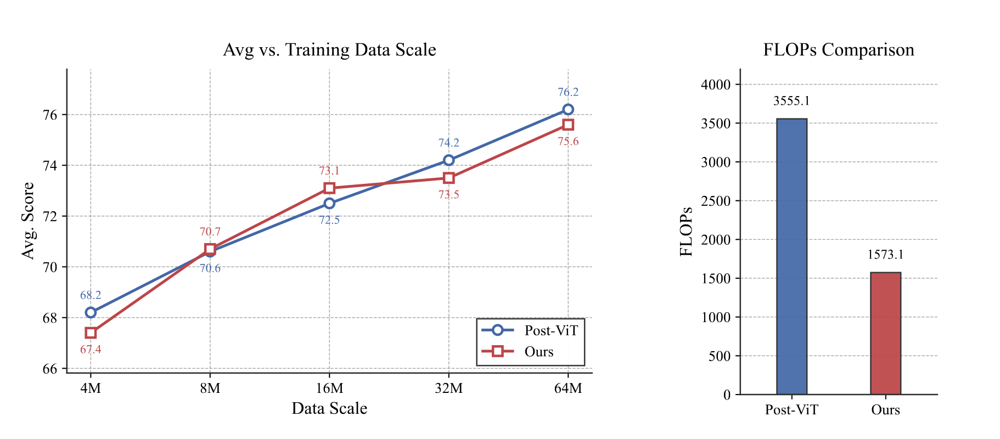
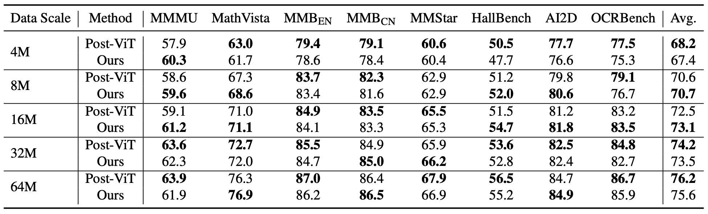
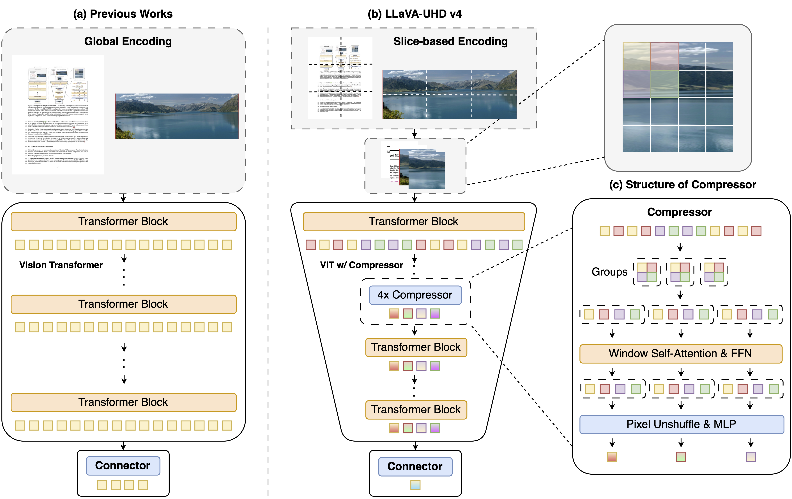

# LLaVA-UHD v4: What Makes Efficient Visual Encoding in MLLMs?

<p align="center">
<a href="https://arxiv.org/abs/2605.08985">[📄arXiv]</a>
<a href="https://huggingface.co/papers/2605.08985">[🤗HF Paper]</a>
</p>

This repository hosts the code and model weights of **LLaVA-UHD v4**, a multimodal large language model (MLLM) designed for efficient high-resolution visual encoding. LLaVA-UHD v4 rethinks the conventional global-encoding-plus-post-ViT-compression paradigm and introduces a slice-based encoding framework with intra-ViT early compression. By moving token reduction into shallow ViT layers, our model substantially reduces the computational cost of visual encoding while preserving fine-grained perception ability.

Across eight standard benchmarks covering document understanding, OCR, mathematical reasoning, and general VQA, LLaVA-UHD v4 matches or even surpasses a post-ViT compression baseline under the same 16× final compression ratio, while reducing visual-encoding FLOPs by 55.8%. These results demonstrate that aggressive token compression can be performed inside the vision encoder without sacrificing downstream performance, offering a practical path toward scalable high-resolution MLLMs.

## News

- **[Coming Soon]** Evaluation code and model checkpoints will be released before **May 24**.
- **[Coming Soon]** Training code will be released before **June 7**.

## Performance




The figure above highlights the core efficiency–performance trade-off of LLaVA-UHD v4. Across training scales from 4M to 64M samples, LLaVA-UHD v4 closely tracks the performance of the strong post-ViT compression baseline, indicating that intra-ViT early compression preserves the model’s scaling behavior. At the same time, by moving part of the token reduction into the vision encoder, LLaVA-UHD v4 reduces visual-encoding FLOPs from 3555G to 1573G, achieving a 55.8% reduction in computation. These results show that high-resolution MLLMs can substantially accelerate visual encoding without sacrificing downstream accuracy.



## Architecture



The figure above illustrates the overall design of LLaVA-UHD v4. Unlike previous high-resolution MLLMs that encode the full image globally and compress visual tokens only after the ViT, LLaVA-UHD v4 adopts slice-based encoding and moves part of the compression directly into the vision encoder. The intra-ViT compressor first performs local window attention to aggregate neighboring visual information, then applies pixel-unshuffle and MLP-based fusion to reduce the token count. As a result, the remaining ViT layers operate on a much shorter visual sequence, substantially lowering the cost of high-resolution visual encoding while maintaining strong fine-grained perception.

## Citation

```bibtex
@misc{fang2026llavauhdv4makesefficient,
      title={LLaVA-UHD v4: What Makes Efficient Visual Encoding in MLLMs?}, 
      author={Kechen Fang and Yihua Qin and Chongyi Wang and Wenshuo Ma and Tianyu Yu and Yuan Yao},
      year={2026},
      eprint={2605.08985},
      archivePrefix={arXiv},
      primaryClass={cs.CV},
      url={https://arxiv.org/abs/2605.08985}, 
}
```